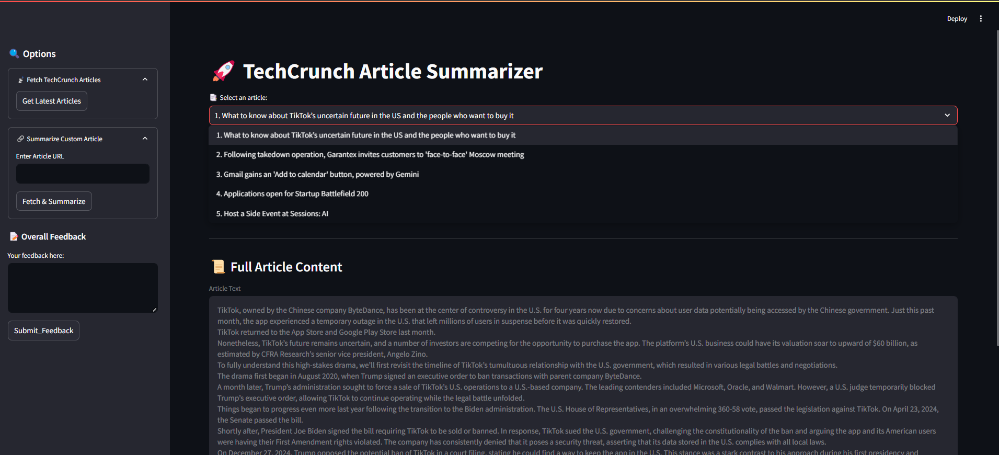
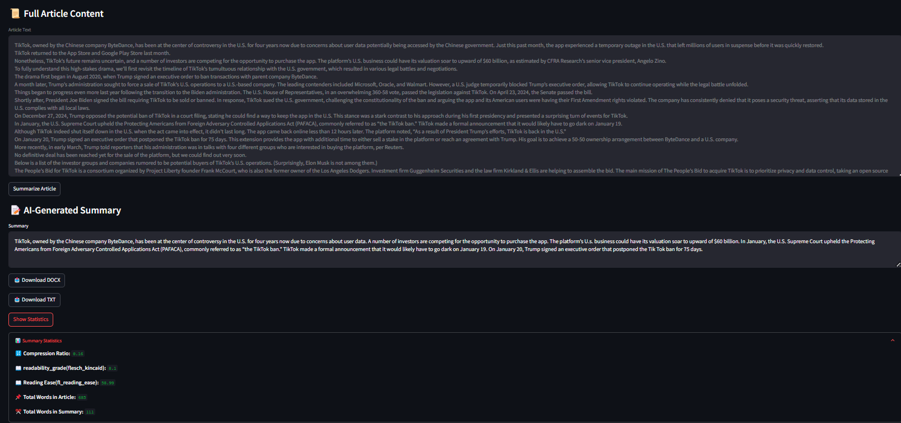
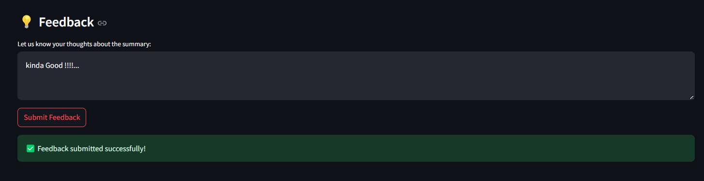
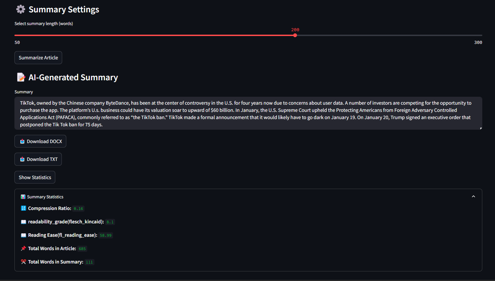
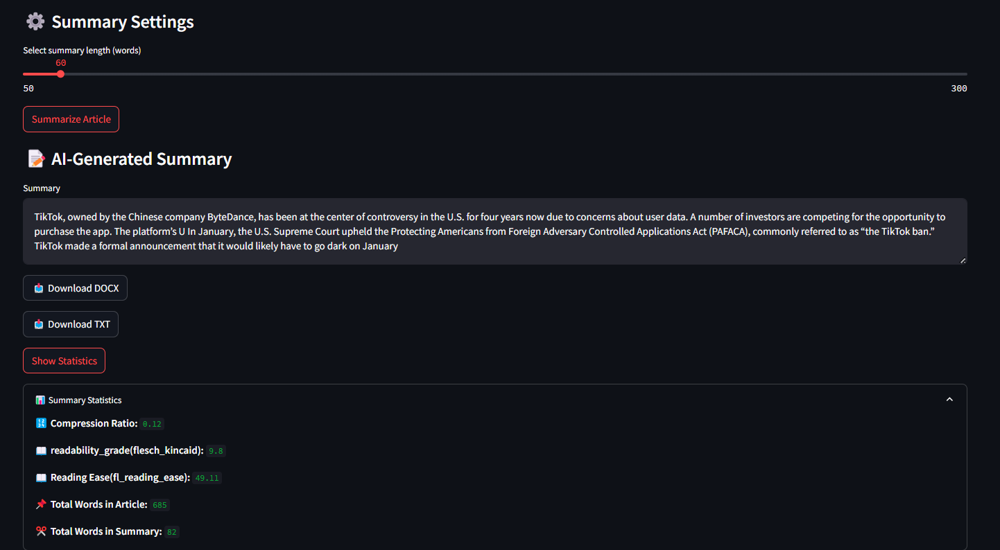

# **TechCrunch Summarizer**  
A Streamlit web app that scrapes the latest TechCrunch articles, summarizes them using the `facebook/bart-large-cnn` model, and presents both original and summarized content in an interactive UI.  

## 🚀 Features  
- **Web Scraping**: Fetches the latest TechCrunch articles with pagination handling.  
- **AI Summarization**: Uses `facebook/bart-large-cnn` for abstractive summarization.  
- **Interactive UI**: Streamlit-based app with article selection, summary length control, and export options.  
- **Custom Article Input**: Users can input any article URL for summarization.  
- **Export Options**: Save summaries as `.txt` or `.docx` files.  
- **Error Handling**: Manages connection issues, HTML structure changes, and model failures.  
- **Logging**: Tracks app usage and debugging information in logs.  

## 🏗️ Installation  

### **1. Clone the Repository**  
```bash
git clone https://github.com/yourusername/techcrunch-summarizer.git  
```

### **2. Create a Virtual Environment & Install Dependencies**  
```bash
python -m venv venv  
source venv/bin/activate  # On Windows use `venv\Scripts\activate`
pip install -r requirements.txt
```

### **3. Run the App**  
# Option 1: Using the Batch Script (Windows)
Run_app.bat

# Option 2: Manually Running Streamlit
```bash
streamlit run src/app.py
```

## 📂 Project Structure  
```
techcrunch-summarizer/
│── data/                  # Saved articles  
│── feedback/              # Stores user feedback  
│── logs/                  # Log files for debugging  
│── models/bart-large-cnn/  # Model and tokenizer files  
│── src/                   # Main source code  
│   ├── scraping/          # Scraper module  
│   ├── summarization/     # Summarizer module  
│   ├── utils/             # Utility functions  
│── streamlit_app/         # Streamlit UI components  
│── temp/                  # Temporary storage for downloads  
│── README.md              # Documentation  
│── requirements.txt       # Dependencies  
│── Run_app.bat            # Windows batch script to run the app  
```

## 📸 Screenshots   

### **1️⃣ Fetching the Latest TechCrunch Articles**  
  

### **2️⃣ Viewing Full Article with Summary & Statistics**  
  

### **3️⃣ Providing Feedback for a Summary**  
  


### **4️⃣ Adjusting Summary Length**  
  
 

## ⚡ Usage  
1. Open the app in a browser after running the command.  
2. Select a TechCrunch article from the sidebar or input a custom URL.  
3. Adjust the summary length and click **Summarize**.  
4. View the original content and summarized text.  
5. Export the summary if needed.  

## 📌 To-Do / Future Enhancements  
- [ ] **Optimize Summary Chunking**: Improve the existing chunking method to enhance coherence across split sections.  
- [ ] **Add Multilingual Summarization**: Extend support for summarizing articles in multiple languages.  
- [ ] **Implement Caching**: Reduce re-scraping by caching previously fetched articles and summaries.  
- [ ] **Enhance UI/UX**: Improve the interface with better readability and interactive elements.  
- [ ] **Integrate More AI Models**: Experiment with other transformer models for improved summarization quality. 
